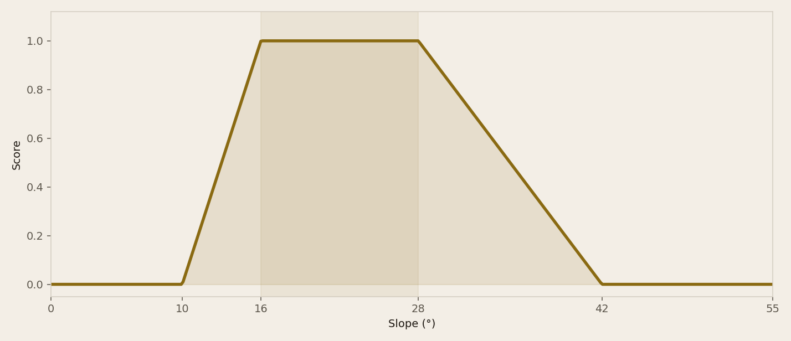
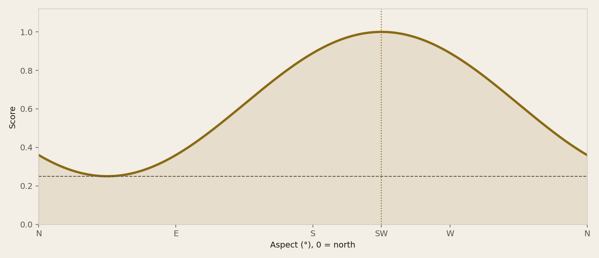
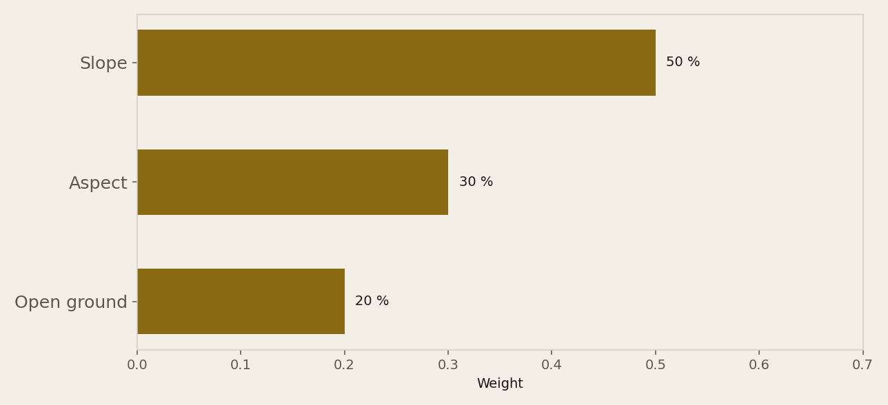

<!-- _class: cover -->
<!-- _paginate: false -->

# How do we recode slope, aspect
# and WALOUS into a 0–1 score
# without fitting a model?

Geospatial · Outdoor recreation · Python / GeoPandas / PostGIS / Streamlit / FME

Ardennes · LiDAR DEM 2021–2022 · cadastral parcel

---

<!-- _class: split -->

# Weighted overlay is
# the founding GIS
# exercise.

Without justified weights it is just a pretty map.

**Here a rejected pixel must be explainable in one sentence.**

---

<!-- _class: split -->

# Who consumes
# the raster.

The club, later the webapp, and a recruiter who opens the repo.

This step's deliverable: a 0–1 raster, not yet a capakey list.

---

<!-- _class: full -->

# Horn gives slope.
# Downslope gives aspect.

Takeoff turns a run into lift on grass. Forest blocks it. A flat cell has no aspect.

---

<!-- _class: split -->

# Three grids,
# one metre, EPSG:3812.

Slope and aspect from the DEM. WALOUS already in Lambert 2008.

We recode and weight. We do not zonal-stat to parcels yet.

---

<!-- _class: split -->

# Terrain is isolated
# from today's wind.

Climatological aspect (SW) weighs 30 %. The 3-day Open-Meteo wind is a filter **afterwards**.

Not both in the same sum.

---

<!-- _class: dark -->

# Scope.

We score suitability at the pixel, Ardennes, one CRS.

We are not a fitted model, not a map of certified sites, and not a nominative table.

---

<!-- _class: chart -->

Usable slope is a window: 0 outside 10–42°, a plateau at 1 between 16° and 28°.

---

<!-- _class: full -->

# 0.50 slope + 0.30 aspect
# + 0.20 land cover. Else veto.

Forest, water, artificial ground, or slope outside the window: the pixel is 0.

---

<!-- _class: chart -->

South-west aspect scores 1. North-east stays at 0.25 — easterly days do happen.

---

<!-- _class: split -->

# WALOUS is not
# a weight like the others.

Grassland 1, bare soil 0.80, crops 0.55.

Everything else is a veto, not a soft penalty.

---

<!-- _class: split -->

# Robustness
# on a synthetic tile.

Same shape, edge NaNs kept, steep forest at 0, NE still above 0.5.

No LiDAR in the repo: the volume stays off git.

---

<!-- _class: chart -->

Why not a classifier? There is no labelled takeoff sample. An overlay can be read and challenged.

---

<!-- _class: dark -->

# Where it breaks.

No field validation.

A 1 m WALOUS cell is not a takeoff strip.

Climatological SW is not Saturday's wind.

---

<!-- _class: cta -->

# Reproduce.

[Source code](https://github.com/dimiphoton/parapente-selection-sites)

`pytest`

`python -m sites_parapente.cli --overlay`

  
