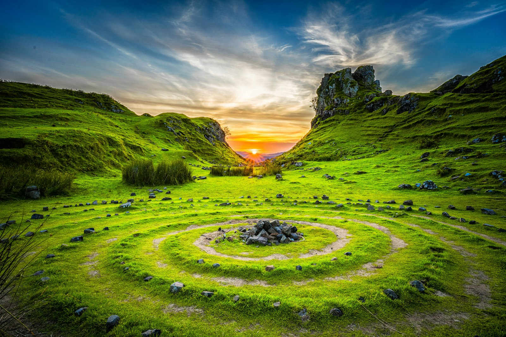
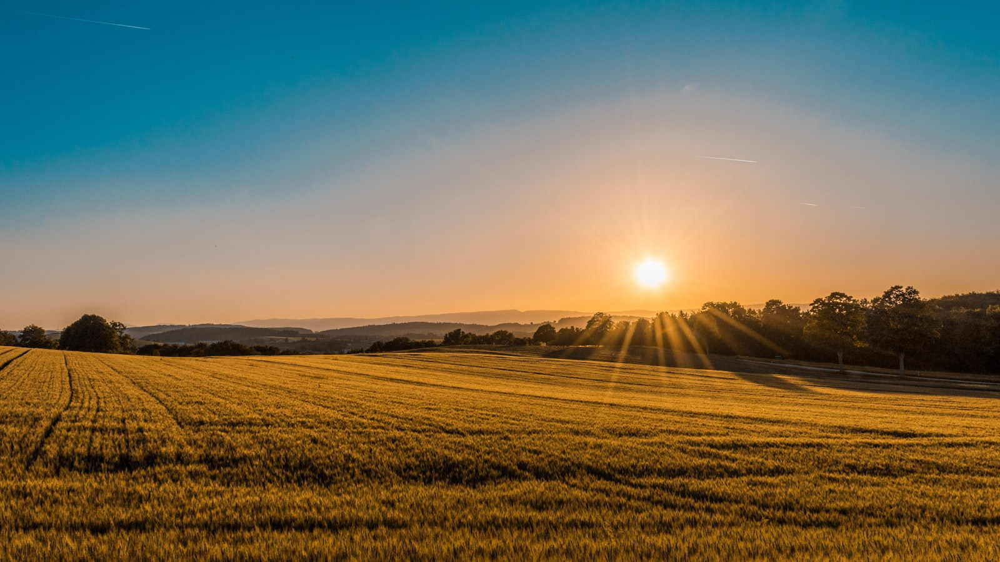
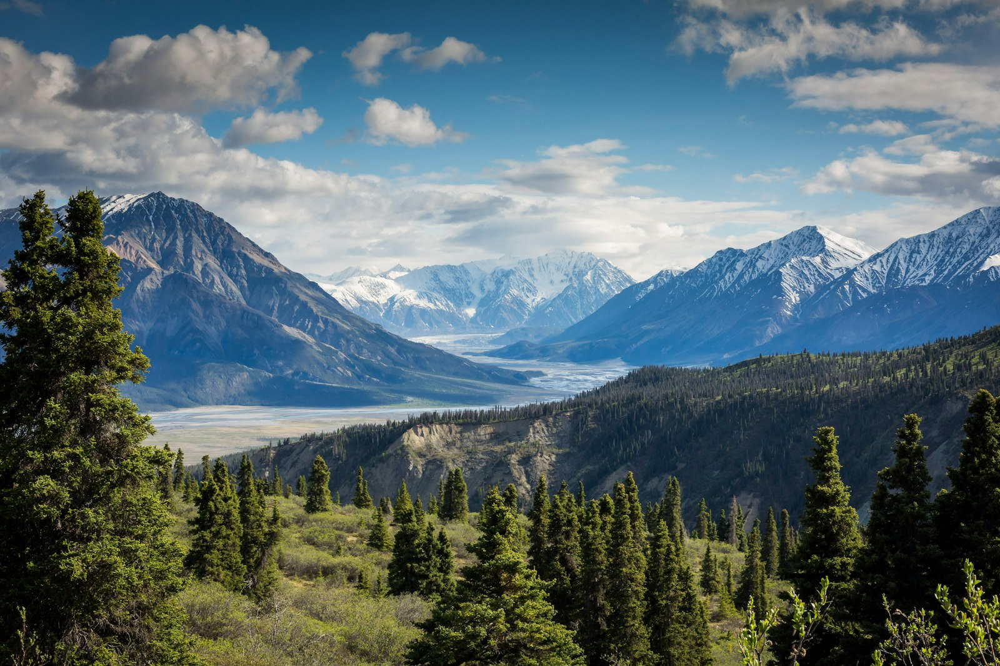
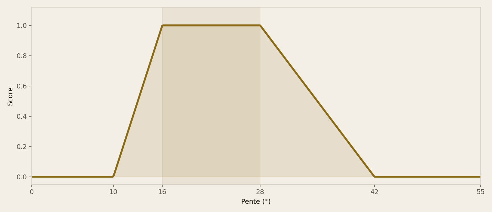
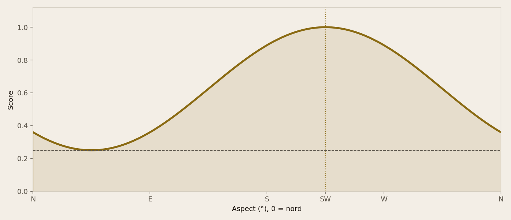
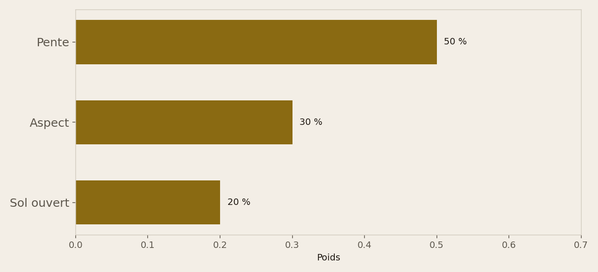
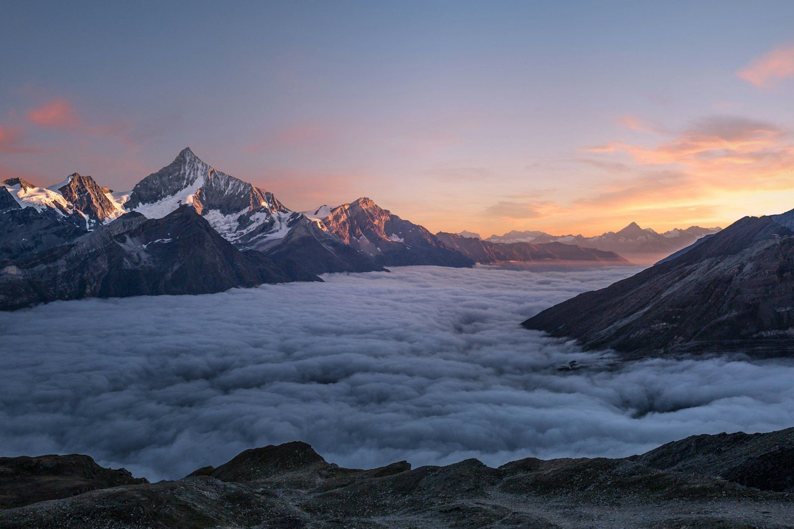

<!-- _class: cover -->
<!-- _paginate: false -->

# Comment recoder pente, aspect
# et WALOUS en un score 0–1
# sans apprendre un modèle ?

Géospatial · Loisirs outdoor · Python / GeoPandas / PostGIS / Streamlit / FME

Ardenne · MNT LiDAR 2021–2022 · parcelle cadastrale

---

<!-- _class: split -->

# L'overlay pondéré
# est l'exercice
# fondateur du GIS.

Sans poids justifiés, ce n'est qu'une carte jolie.

**Ici : un pixel inapte doit pouvoir s'expliquer en une phrase.**

---

<!-- _class: split -->

# Qui consomme
# le raster.

Le club, plus tard la webapp, et un recruteur qui ouvre le dépôt.

Le livrable de cette étape : un raster 0–1, pas encore une liste de capakey.

---

<!-- _class: full -->

# Horn donne la pente.
# L'aval donne l'aspect.

Décoller, c'est convertir une course en portance sur de l'herbe. La forêt coupe. Un versant plat n'a pas d'orientation.

---

<!-- _class: split -->

# Trois grilles,
# un mètre, EPSG:3812.

Pente et aspect dérivés du MNT. WALOUS déjà en Lambert 2008.

On recode, on pondère, on n'agrège pas encore à la parcelle.

---

<!-- _class: split -->

# On isole le terrain
# du vent du jour.

L'aspect climatologique (SW) pèse 30 %. Le vent Open-Meteo à 3 jours est un filtre **après**.

Pas les deux dans la même somme.

---

<!-- _class: dark -->

# Périmètre.

On note un score de suitability au pixel, Ardenne, CRS unique.

On n'est pas un modèle appris, ni une carte de sites homologués, ni une table nominative.

---

<!-- _class: chart -->

La pente utile est une fenêtre : 0 hors de 10–42°, plateau à 1 entre 16° et 28°.

---

<!-- _class: full -->

# 0,50 pente + 0,30 aspect
# + 0,20 sol. Veto sinon.

Forêt, eau, artificialisé, ou pente hors plage : le pixel vaut 0.

---

<!-- _class: chart -->

Face au sud-ouest le score d'aspect vaut 1. Face au nord-est il reste à 0,25 — les jours d'est existent.

---

<!-- _class: split -->

# WALOUS n'est pas
# un poids comme les autres.

Prairie 1, sol nu 0,80, culture 0,55.

Tout le reste est un veto, pas une pénalité douce.

---

<!-- _class: split -->

# Robustesse
# sur tuile synthétique.

Même forme, NaN de bord conservé, forêt pentue à 0, NE encore > 0,5.

Pas de LiDAR dans le dépôt : le volume reste hors git.

---

<!-- _class: chart -->

Pourquoi pas un classifieur ? Aucun échantillon de décollages labellisés. Un overlay se lit et se conteste.

---

<!-- _class: dark -->

# Où ça casse.

Pas de validation terrain.

WALOUS à 1 m n'est pas une bande de décollage.

Le SW climatologique n'est pas le vent de samedi.

---

<!-- _class: cta -->

# Reproduire.

[Code source](https://github.com/dimiphoton/parapente-selection-sites)

`pytest`

`python -m sites_parapente.cli --overlay`

  
